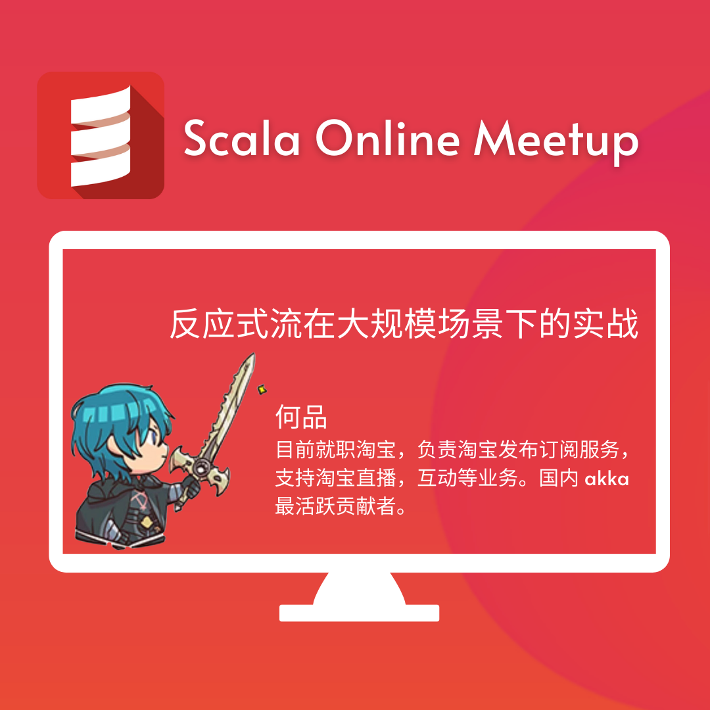
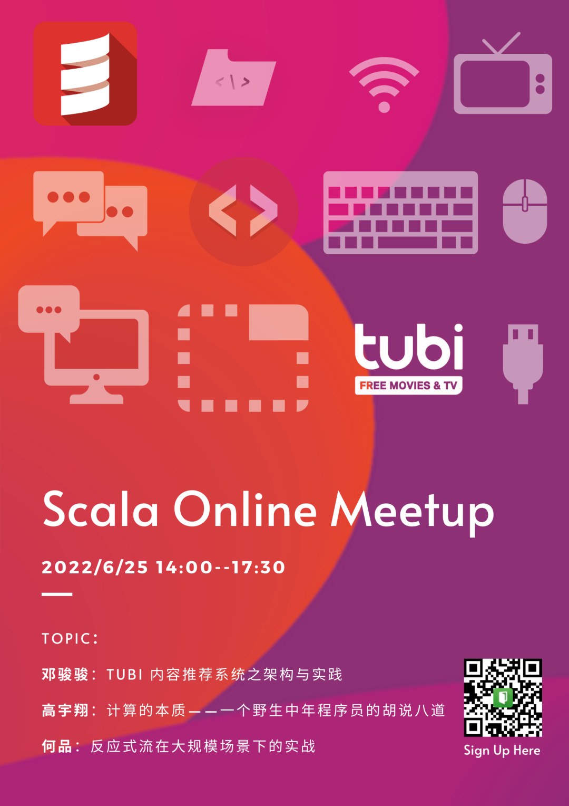

Scala 3 发布以来，关于 Scala 的讨论再次热烈。第七期 Scala Meetup 邀请大家线上聚会，再次为 Scala 也为感兴趣 Scala的自己创造一个开放自由的空间，共同讨论、学习和彼此激励。

## 活动信息

+ 时间：2022/6/25 14:00-17:30
+ 地址：比图科技B站直播间
+ 分享主题：三位重磅嘉宾将为本次 Meetup 带来精彩各异的分享，以下简介排序不分前后。

## 活动说明
+ 本次活动免费
+ 报名后请添加微信 15600819309， 备注 scala meetup， 加入活动群，我们将在群里分享 zoom 会议号
+ 欢迎大家带自己的同事和朋友一起参加，请提前为他们报名

## 主办方 & 赞助方
### Tubi （比图科技）
Tubi 是美国福克斯集团下独立运营、以广告获取收益的流媒体服务公司，为 51,000,000 月度活跃用户免费提供 40,000+ 部优质电影电视节目和 100+ 新闻直播频道。

美国、加拿大、墨西哥、澳大利亚和新西兰等全球用户可通过电视、网页、iOS、Android 等 25 种用户端，免费观看 Tubi 提供的定制化视频。Tubi 与派拉蒙、米高梅、狮门、Starz、万达影业等超过 250 个 Studio 有长期稳定合作。

Tubi 总部位于美国旧金山，目前拥有 400+ 员工并持续壮大中。2016 年，由于湾区技术人才供需紧张，华人工程师能力受到肯定，跨区域研发运维具有明显优势，Tubi 中国团队——比图科技应运而生。

区别于大多数驻扎在中国的外企研发中心，Tubi 中国团队并非总部的补充，也并非一个专门处理本地化需求的团队，从建立伊始，我们的目标就是打造一支具有国际化视野的、能力一流、和总部研发团队并肩作战的团队。如今，这支近百人的队伍已然成为 Tubi 的核心研发力量，为数千万级用户的观影体验保驾护航。

## 协办方
“织码开门”旨在探索新的编程培训模式，培养新一代软件工程师。织码开门采用教学课件，线下动手实验室以及项目实训的方式来让学员学做结合，知行合一；为企业输送面向未来的 IT 技术人员。

博文视点（Broadview）是电子工业出版社下属旗舰级子公司。多年来，博文视点深耕专业出版，以敏锐眼光、独特视角密切关注技术发展趋势及变化，致力于将技术大师之优秀思想、一线专家之一流经验集结成书。历经近 20 年不懈努力，汇集了众多优秀专家作者，沉淀下一大批经久不衰的经典著作。

